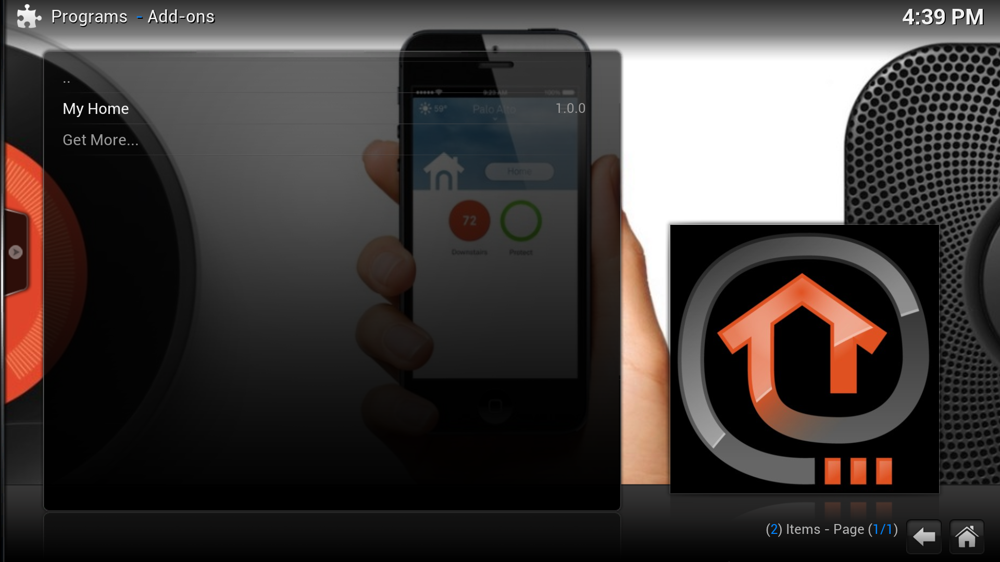
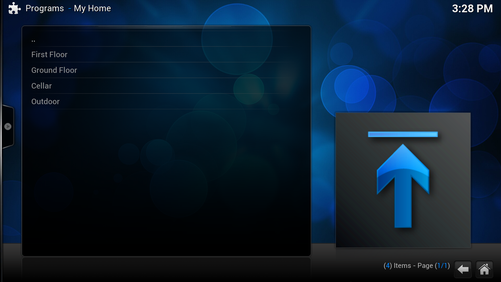
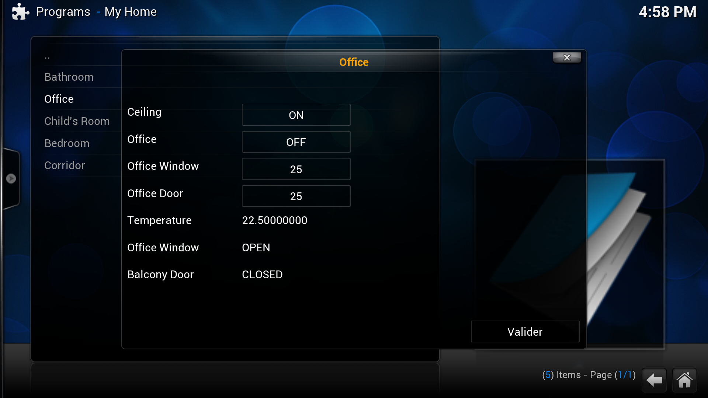

## Introduction
This is a Kodi (formerly known as xbmc) plugin for Openhab.  It allows users to control Openhab from within the Kodi environment.  The orignal project was created for xmbc originally created by a group RICM5 2014 students. The original page in French is located here http://air.imag.fr/index.php/Extensions_XBMC.

The code as it stands now is compatible with the Kodi (Helix) the current version at the time of writing this.

## Installation and Usage
1. [Download](https://raw.githubusercontent.com/enishoca/openhab-kodi/master/openHab-Kodi.1.0.2.zip) the current version or alternatively click on the the zip file link above - then right click on 'View Raw' link and save the file.  
DO NOT Use the zip downloaded with ZIP button on this page directly on Kodi, it downloads the source tree which is not an addin zip.
2. install it as you would normally install Kodi addons. You will need to go in the setings menu and change the default settings for the addon to match your installation.

e.g.

1. Server IP address : 127.0.0.1
1. Server port : 8080 
1. Sitemap name : default
1. Start page : default

##Screenshots from the original addin

